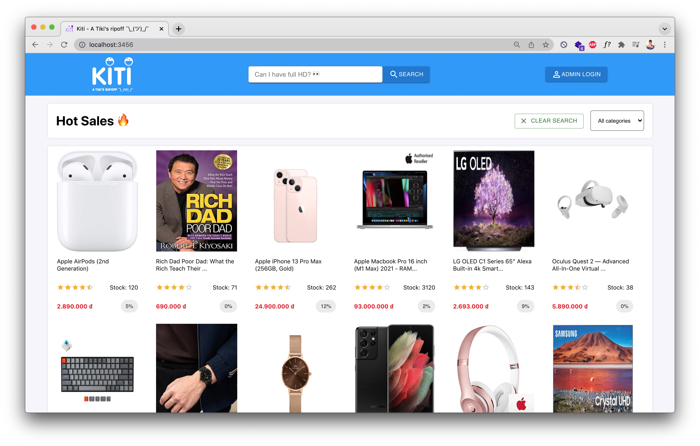
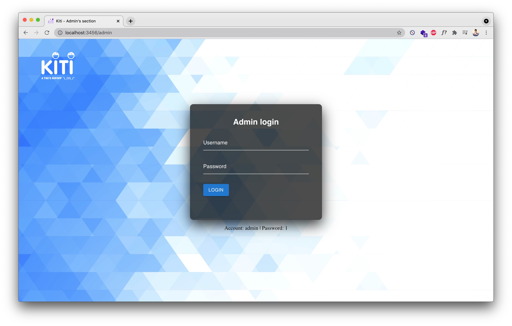
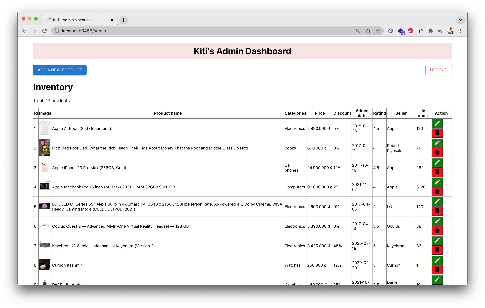
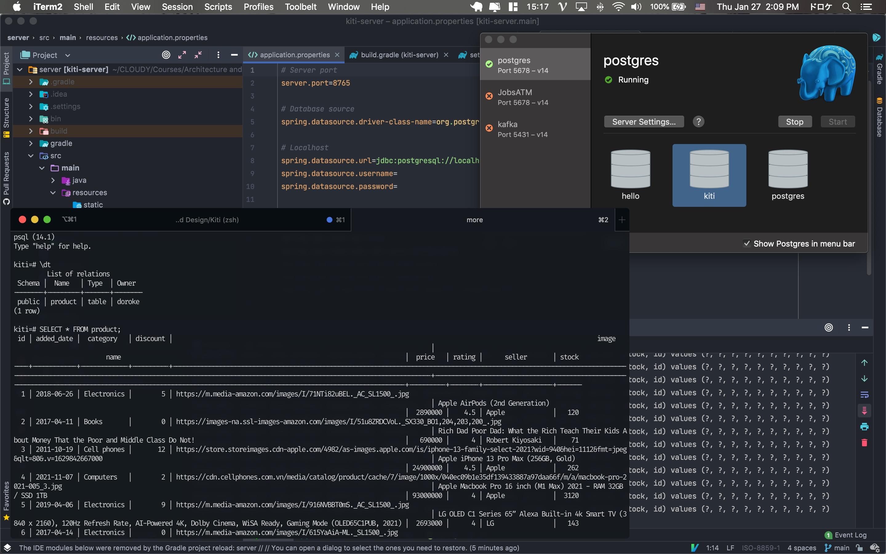
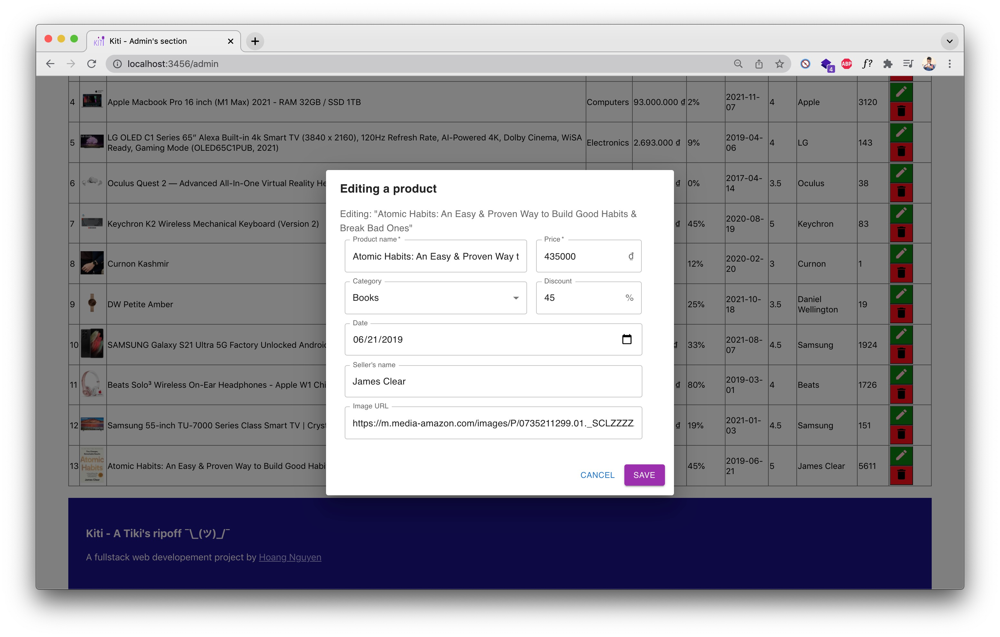
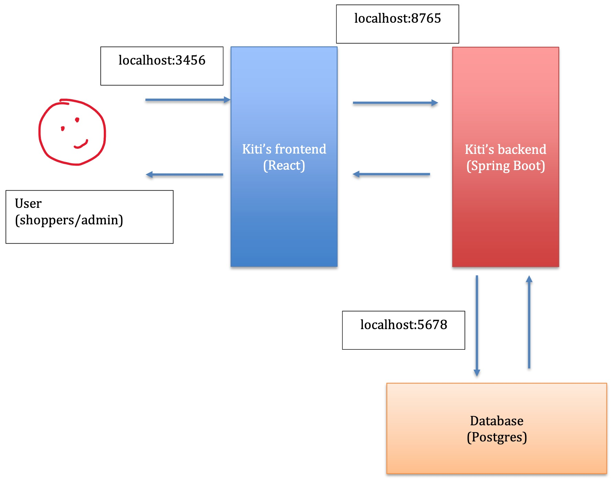

# Kiti

> Kiti - a Tiki's ripoff ¯\\\_(ツ)_/¯

## Table of Contents
* [Project Description](#description)
    * [Tech stack](#techStack)
* [How to run project?](#run)
* [App screenshots](#screenshots)

## Project Description

**Kiti** is an e-commerce web application built with state-of-the-art technology stacks. It has 2 main separate sections for buyers to shop for items and admin to manage the store's inventory. It allows admin to perform full CRUD operations on the items. This is a 2-day individual project 1 for EEET2582 - Software Engineering: Architecture and Design. 
The UI <s>rips off</s> is inspired by Tiki's website ¯\\\_(ツ)_/¯

### Tech stack

- Frontend: ReactJS, Material-UI
- Backend: Spring Boot
- Database: PostgreSQL

## How to run project?

Start the services following this order:
1. Create a database name `kiti` in Postgres at port 5678. Use <a href="https://postgresapp.com/" target="_blank">postgresapp</a> to start up the Postgres server.
2. Start backend: import folder `server` into IntelliJ, run the project. Or run from the terminal using `gradle bootRun` (this project uses Gradle to build)
3. Start frontend: go to `client` folder, first install the dependencies with `npm install` or `yarn install`. Then run `yarn start` to start the web UI at port 3456.

Admin can login with info `admin:1`

## App screenshots

Admin login

Inventory management

Backend (Spring Boot + Postgres)

Dialogs

System design

## Connect with me
* My [Personal website](https://hoangdesu.com/)
* My [LinkedIn](https://www.linkedin.com/in/hoangdesu/)
* My [Facebook](https://www.facebook.com/Hoangdayo/)
* My [Instagram](https://www.instagram.com/hoang.desu/)
* You can shoot me an [email](mailto:hoangdesu@gmail.com) too

If you find this project helpful, consider dropping me a star ⭐️ !

---
Hoang Nguyen © 2021